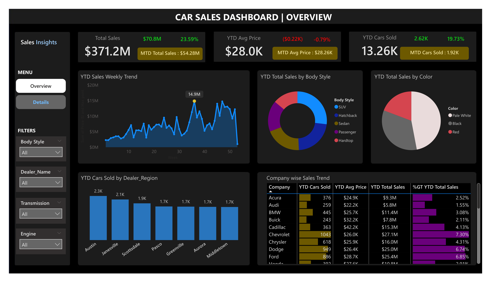
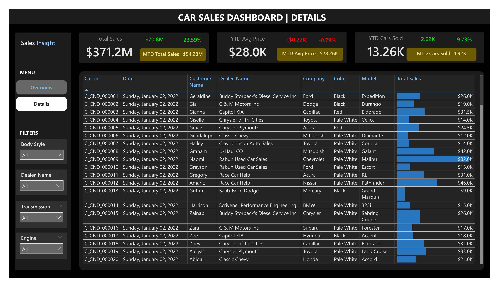

# CAR SALES DASHBOARD | POWER BI

## Overview
This project is an interactive Power BI dashboard developed to analyze car sales performance, dealer activity, customer purchasing trends, and vehicle sales insights.

The dashboard transforms raw sales data into meaningful business insights using Power BI, DAX, Power Query, and data visualization techniques.

---

## Business Problem
Car dealerships need an efficient way to monitor sales performance, identify high-performing vehicle categories, track regional sales distribution, and analyze customer purchasing behavior.

This dashboard helps stakeholders make data-driven decisions by providing real-time insights into sales trends, pricing, dealer performance, and vehicle demand.

---

## Objectives
- Analyze overall sales performance
- Monitor YTD and MTD sales metrics
- Evaluate regional dealer performance
- Identify top-performing car companies
- Analyze sales trends by body style and color
- Track average vehicle prices
- Visualize weekly sales trends
- Provide detailed transactional insights

---

## Tools & Technologies
- Power BI
- Power Query
- DAX
- Data Modeling
- Data Visualization
- Excel

---

## Key Features
### KPI Metrics
- YTD Total Sales
- MTD Total Sales
- YOY Growth in Sales
- YTD Average Price
- MTD Average Price
- YTD Cars Sold
- MTD Cars Sold

### Dashboard Visuals
- Weekly Sales Trend
- Sales by Body Style
- Sales by Vehicle Color
- Sales by Dealer Region
- Company-wise Sales Trend
- Detailed Sales Table

---

## Dashboard Pages

### 1. Overview Dashboard
Provides a high-level summary of:
- Sales performance
- Weekly sales trends
- Regional sales analysis
- Company performance
- Vehicle category insights

### 2. Details Dashboard
Displays:
- Individual sales records
- Customer information
- Dealer information
- Vehicle details
- Sales amounts

---

## Key Insights
- Total car sales reached **$371.2M**, with **YTD sales increasing by $70.8M**, representing a **23.59% year-over-year growth**.
- The dealership sold **13.26K cars YTD**, an increase of **2.62K cars**, representing **19.73% growth** compared to the previous year.
- The average vehicle price was **$28.0K**, with a slight decline of **$0.22K**, representing a **-0.79% YOY change**.
- Month-to-date sales reached **$54.28M**, while MTD cars sold totaled **1.92K**.
- Austin was the top-performing dealer region with approximately **2.3K cars sold**, followed by Janesville with **2.1K cars**.
- Chevrolet generated the highest company sales among visible brands, with **$27.1M in YTD sales** and **1,043 cars sold**.
- Ford followed closely with **$25.4M in YTD sales** and **886 cars sold**.
- Weekly sales peaked at approximately **$14.9M**, showing the strongest sales activity around the mid-to-late year period.
  
---

## Skills Demonstrated
- Data Cleaning
- Data Transformation
- Data Modeling
- DAX Calculations
- Time Intelligence Functions
- KPI Development
- Dashboard Design
- Business Intelligence Reporting
- Interactive Visualization

---

## Project Structure

```text
car-sales-dashboard-powerbi/
│
├── assets/
│   ├── overview-dashboard.png
│   └── details-dashboard.png
│
├── dashboard/
│   ├── carsales.pbix
│   └── carsales.pdf
│
├── dataset/
│   └── Car Sales.xlsx
│
└── README.md
```

---

## Dashboard Preview

### Overview Dashboard


### Details Dashboard


---

## Author
Mateyenu Moferi Adamu
